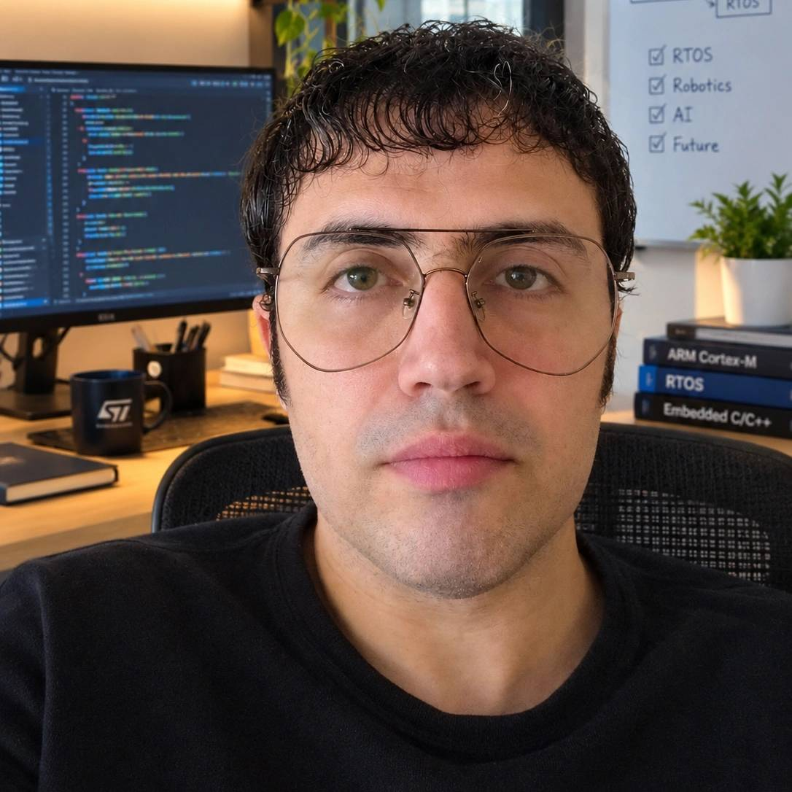

---
title: ""
---

<h1 class='blue-text'>سید حسین هاشمی رودمعجنی</h1>

<a href="tel:+989127219210"><strong>
<big class='redblue-text'>☎  ۰۹۱۲ ۷۲۱ ۹۲۱۰</big></strong>
</a>

<a href="mailto:h.hashemirud@gmail.com">
✉ h.hashemirud@gmail.com
</a>

<a href="https://github.com/hoseinhashemirud" target="_blank">
GitHub
</a>

<a href="https://hoseinhashemirud.github.io/resume/" target="_blank">
Online Resume
</a>

  

من در زمینه ی مهندسی برق گرایش الکترونیک و کنترل، در زمینه ی علوم کامپیوتر، در گرایش هوش مصنوعی و رباتیک کار می کنم. **برخی از پروژه هایی** که انجام داده ام، در زیر آمده است:

- طراحی بی سیم دستگاه پزشکی پالس اکسی متر، سال ۸۸

- طراحی کنترل کننده ی فازی برای ربات ژیمناست با سه بازو و دو عملگر، سال ۹۰

- ترسیم خروجی توابع با منطق فازی، سال ۹۰

- بررسی رویت پذیری سیستم دینامیک الستیک غیرخطی، سالهای ۹۰ و ۹۱

- طراحی کنترلر برای سخت افزار در حلقه ی جسم پرنده، سال ۹۲

- برنامه نویسی میکروکنترلرهای Atmel و ARM برای تسترها و تجهیزات ذخیره ی داده، سالهای ۹۴ و ۹۵

- طراحی گرافیکی مدار چهارلایه ی  PCB ذخیره ساز داده، سال ۹۵ 

- طراحی گرافیکی مدار چهارلایه ی  PCB  ذخیره ساز تصویر، سال ۹۶

- مونتاژ قطعات الکترونیک روی برد PCB ، و هماهنگی با واحد مکانیک برای طراحی جعبه ی آن، سال ۹۵

- ترجمه ی دوره ی امنیت صنعتی SANS، ، برای امنیت شبکه های صنعتی و ارائه ی آن، سال ۹۷

- موقعیت یاب سه بعدی معدنچی با bluetooth beacons و طراحی برنامه ی iOS آن، سال ۱۴۰۲

- طراحی دیتابیس برای پروژه ی موقعیت یاب سه بعدی، سال ۱۴۰۲

- ارائه ی راه حل برای مسائل leetcode، سال های ۱۴۰۱ و ۱۴۰۲

- برنامه نویسی شئ گرای اداره ی یک فروشگاه کتاب، سال ۱۴۰۱

- برنامه نویسی شئ گرای اداره ی یک بیمارستان، سال ۱۴۰۱ 

- بهینه سازی عبور معدنچیان از تونلهای معدن در طبفات مختلف به کمک بهینه سازی الگوریتم فرار از معدن در حین حادثه، سال ۱۴۰۳

- اندازه گیری تاخیر زمان حقیقی در ارتباط سریال بین Host و میکروکنترلر ARM، سال ۱۴۰۴

- طراحی عامل هوش مصنوعی (AI Agent) ،  مدرن برای سیستمهای رباتیک، سال های ۱۴۰۴ تا ۱۴۰۵

-------------------------------------------------------------------------------

**سوابق شغلی** اینجانب به شرح زیر است:

- مهندس برق کنترل، پژوهشکده ی صنعت برق، سالهای ۹۲ تا ۹۳، تهران

-  مهندس برق الکترونیک، پژوهشکده ی صنعت برق، سالهای ۹۳ تا ۹۶، تهران

- نویسنده ی گروه امنیت شبکه های صنعتی، فرازپژوهان دانش، سال ۹۷ تا ۹۸، تهران

- دستیار آموزشی دانشکده برق، دانشگاه نوادا، سال ۱۴۰۰، رینو 

- دستیار پژوهشی، مرکز تحقیقات Paul Laxalt، سال ۱۴۰۱، رینو

- دستیار آموزشی دانشکده فیزیک، سال ۱۴۰۱، دانشگاه نوادا، رینو 

- دستیار پژوهشی، مرکز تخقیقات Paul Laxalt،سال ۱۴۰۲ تا ۱۴۰۳ ، رینو

- مهندس برق کنترل، سامانه صنعت طاها، تابستان ۱۴۰۴، تهران

- توسعه ی دهنده ی عامل هوش مصنوعی، دورکاری، سالهای ۱۴۰۴ و ۱۴۰۵ 

-------------------------------------------------------------------------------

همچنین بعضی از **دوره هایی** که در آنها شرکت کرده ام به شرح زیر است:

- دوره ی برق صنعتی، تئوری و آزمایشگاه، سال ۱۴۰۵، مجتمع فنی

- دوره ی زبان برنامه نویسی پایتون، سال ۱۴۰۲، Udemy

- دوره ی الگوریتم و ساختار داده ی پایتون، سال ۱۴۰۲، Udemy

- دوره ی زبان انگلیسی سطح Evolve 5، سال ۱۴۰۵، موسسه ی ایران-اروپا

-------------------------------------------------------------------------------

همچنین تجربه ی انجام پروژه با **نرم افزارهای** زیر را دارم:

- Python & its packages: NumPy, Pandas, SciPy, Scikit-Learn, Keras, PyTorch, TensorFlow, Matplotlib, Scrapy, BeautifulSoup.

- SQL(postgre), Modern C++, html and CSS, Linux OS, Microsoft Office, VSCode, AI chatbots, AI Agent API Developers.

- IAR Systems, KEIL, Altium Designer, AVR CodeVision, Matlab & Simulink.

- همجنین Eplanو برق صنعتی رامی دانم و علاقه مندم در حوزه ی برق اتوماسیون همکاری کنم. 

-------------------------------------------------------------------------------

**تحصیلاتم** به شرح زیر می باشد:

۱- کارشناسی ارشد علوم کامپیوتر، دانشگاه نوادا، ایالات متحده امریکا

۲- کارشناسی ارشد مهندسی برق، دانشگاه صنعتی امیرکبیر، تهران

۳- کارشناسی مهندسی پزشکی، دانشگاه شاهد، تهران

-------------------------------------------------------------------------------

اطلاعات شخصی من به شرح زیر است:

- مجرد

- متولد دی سال ۶۴

- دارای معافیت کفالت 

- ساکن بلوار کاشانی، تهران  

۱۲ مهر ۱۴۰۵